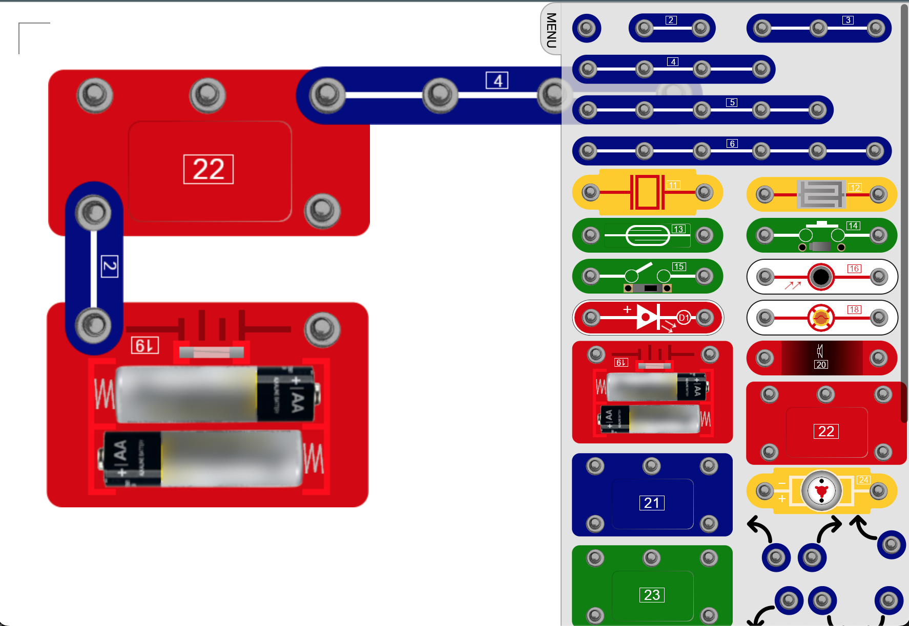

# clipcircuit
Clip circuit creator

This let you (re-) create the circuits for
Heebie Jeebies Advanced Lab Clip circuit
Also available under the brand/name "Elenco Snap circuits"

# creator
Noel Verschaeren

# version
1.0

# Licence
CC0 1.0 Universal

# about
I bought a clip circuit set for my kids, but being Dutch and kids being young i was in need of a Dutch translation of the manual.

After trying a few translations options from scans i decided i needed to re-create the images available, and re-create the manual.

This project contains a html document where you can drag and drop the different clip-circuit components to your canvas and re-create the different setups from the manual, but also create your own custom ones.

# how it works
Open the [index.html](creator/index.html) file in your browser. In the site menu on the right you will find al components. Click a component to add it to the canvas. Clicking a component on the canvas will bring it on top of all other components.

When you put your mouse on top of a component on the canvas you can:
- delete it from canvas by clicking the X
- rotate it 90 degrees by clicking the rotate button
- move it on the canvas (grid) by holding your mouse down on the drag symbol and more it arround

The whole background is a text-field, so click in the white background and type the text you want to add to the image before taking a screen-shot (used to add the A B C characters that the text within the manual will refer to).

# to do
For now i took screen-shots and used the images in the re-recreated Dutch manual. Final idea is to add an optional menu to save a canvas in local-storage and open it again later.

# Other languages
Please let me know when you created a translation of the original manual so I can add them to this repositiory.

Here a video of the original product:
[Advanced Lab Features Clip Circuit on youtube](https://www.youtube.com/watch?v=IKHJE-X8HT8)